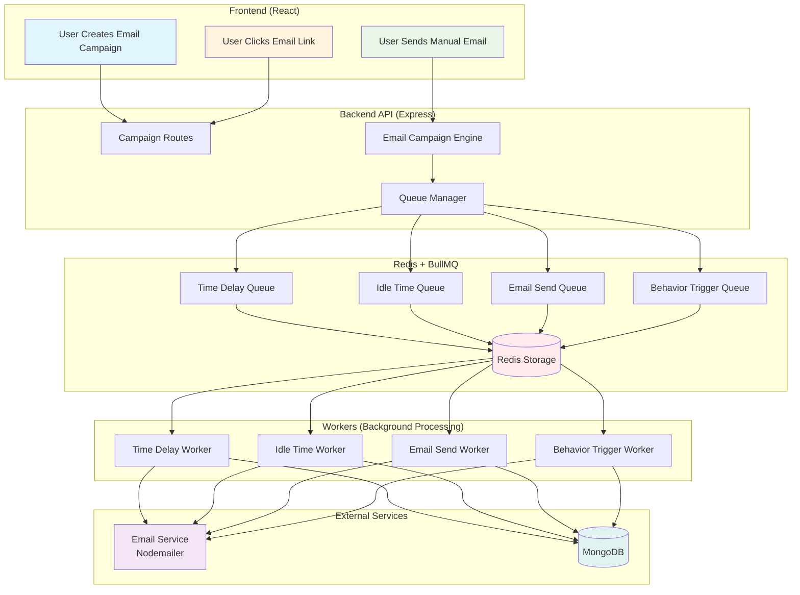
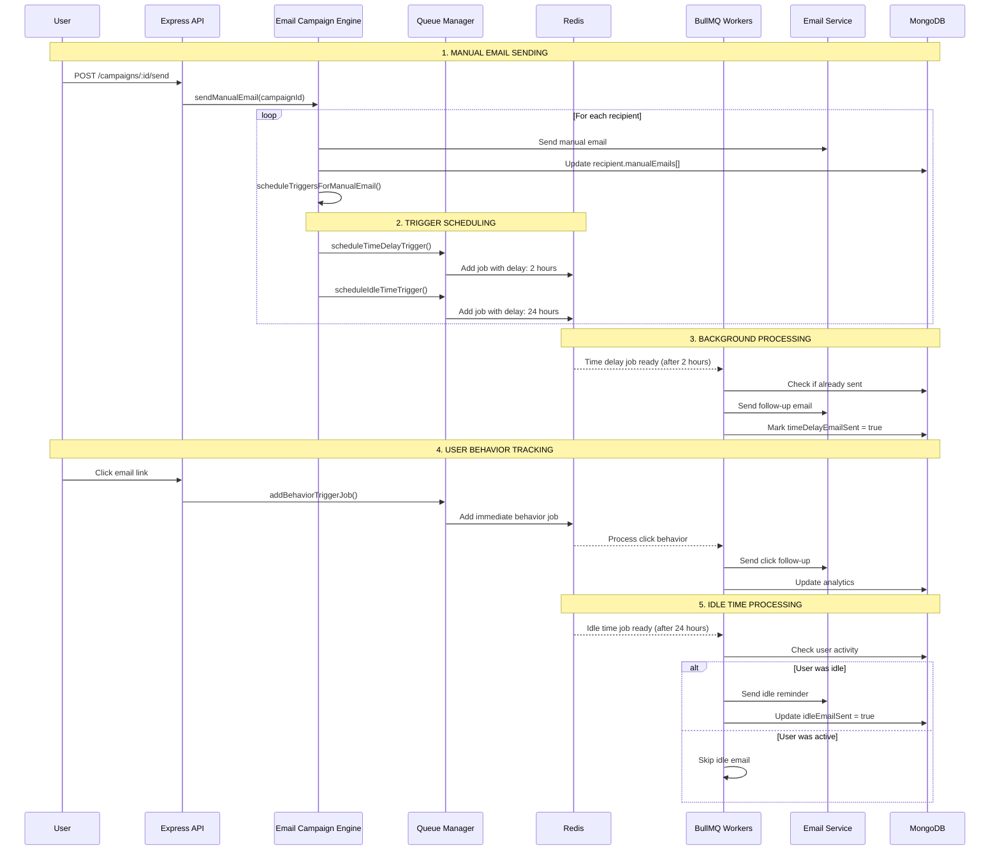
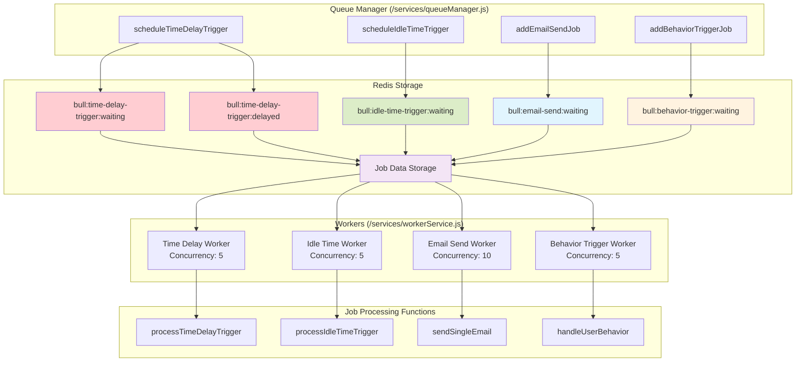
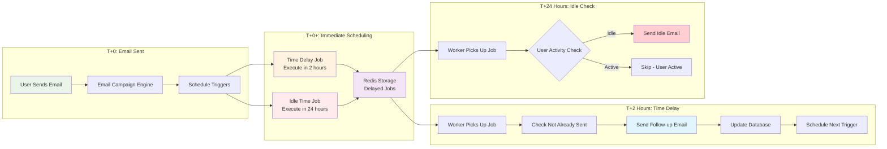
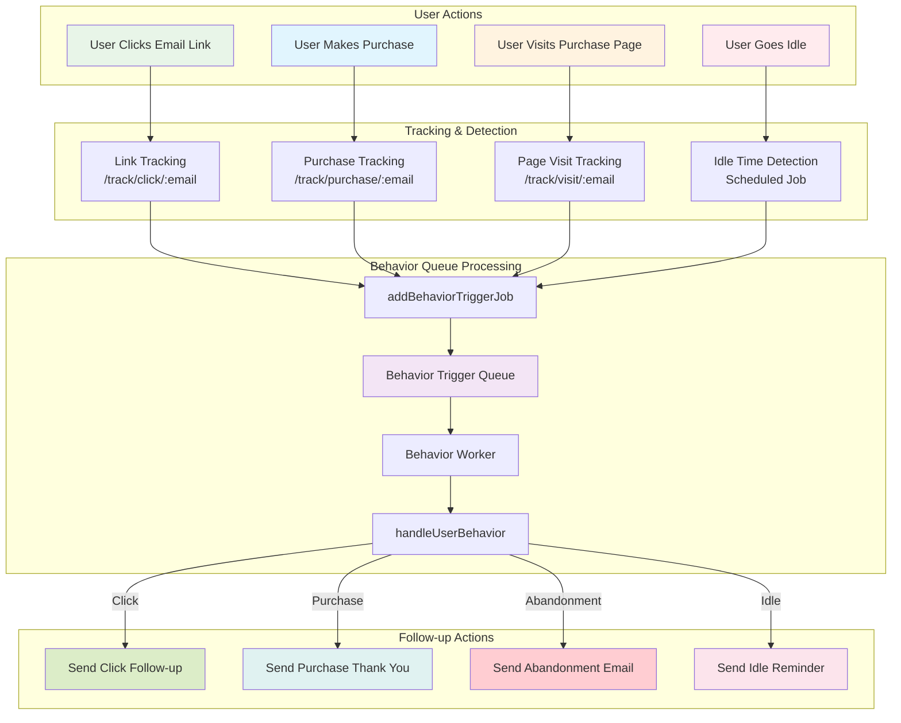
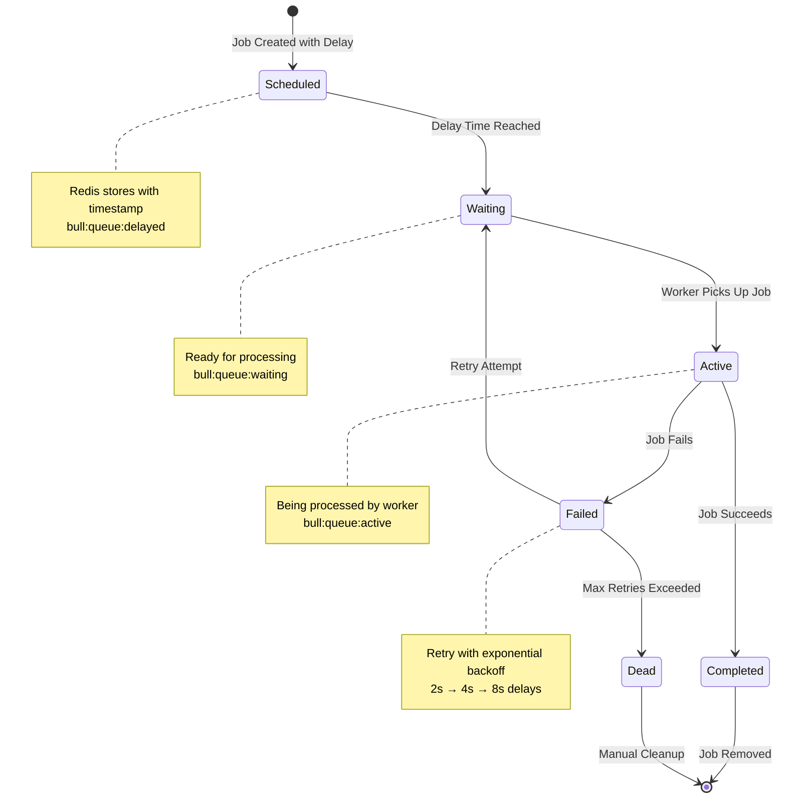
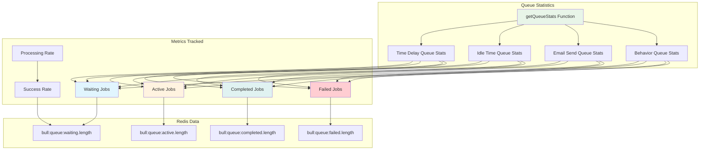
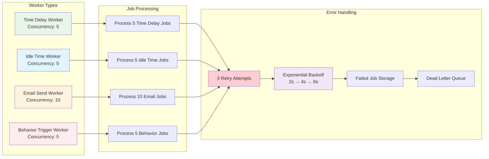

# 🚀 **BullMQ & Redis Workflow - Complete Process Flow**

## **📊 Main Architecture Overview**

## **⚡ Detailed Email Campaign Flow**

## **🔧 BullMQ Queue System Architecture**

## **⏰ Time-Based Trigger Flow**

## **🎯 Behavior-Triggered Email Flow**

## **🔄 Redis Job Lifecycle**

## **📊 Queue Statistics & Monitoring**

## **🔧 Worker Configuration & Concurrency**

