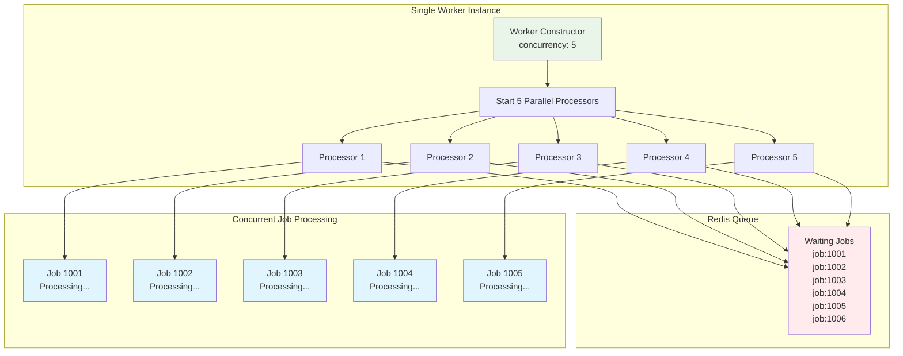
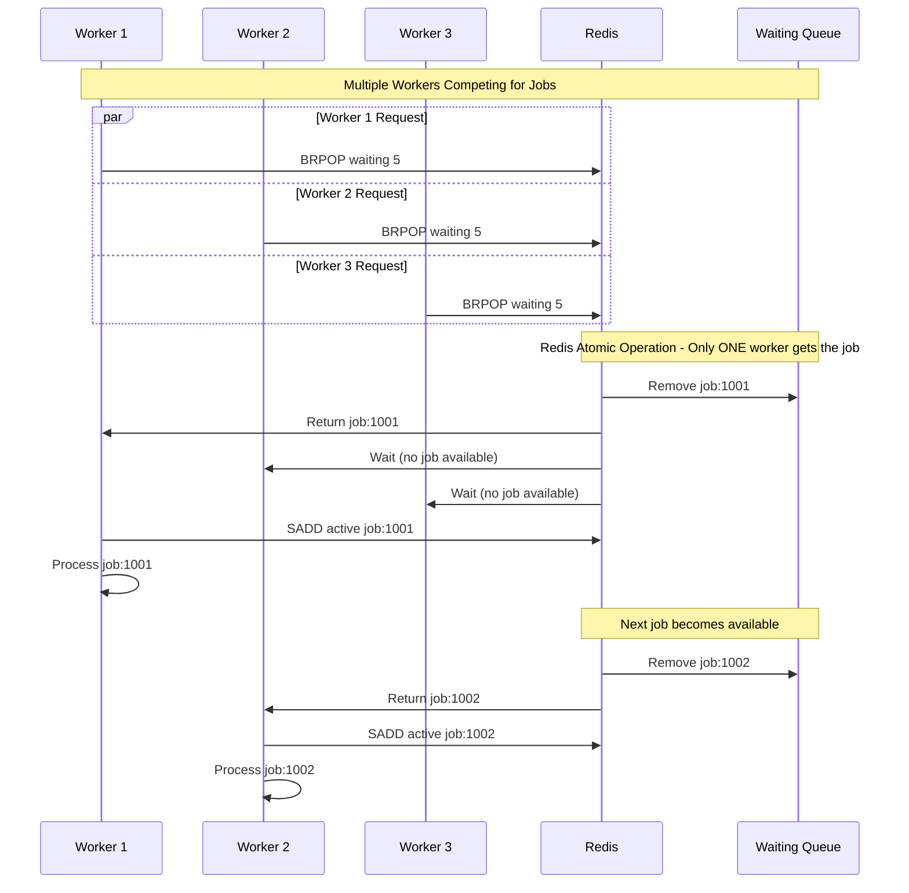
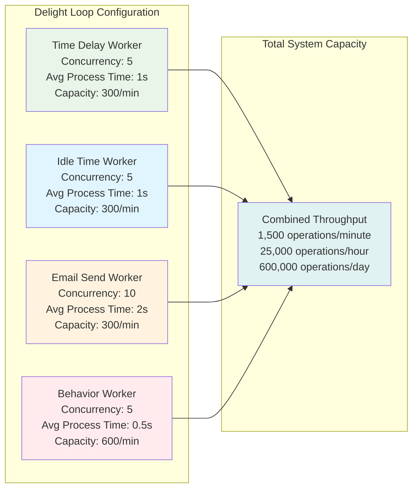
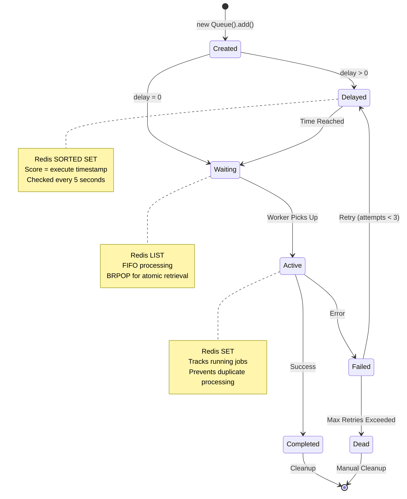
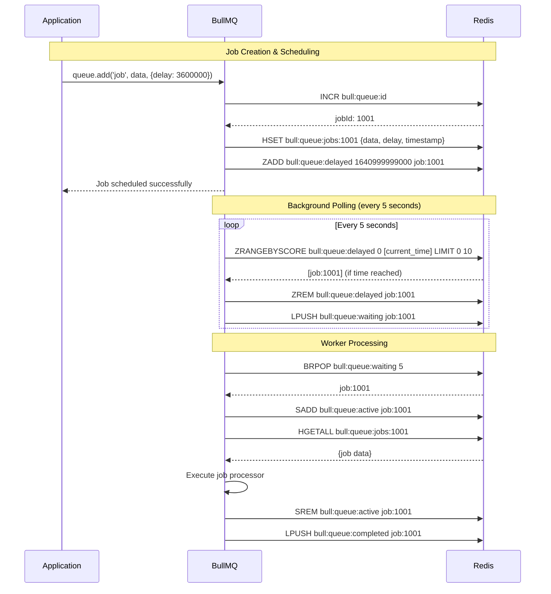
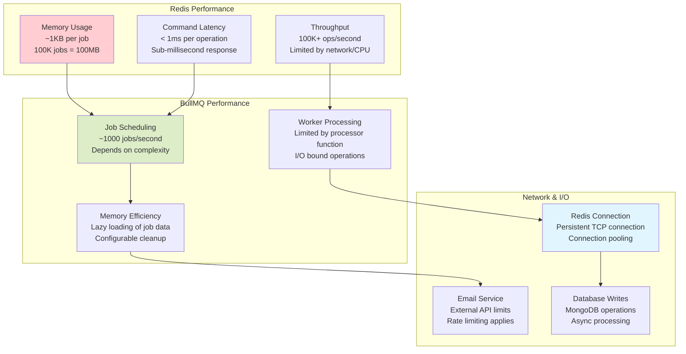

# 🔧 **Redis & BullMQ Internal Mechanisms - Visual Guide**

## **📊 Redis Data Structures in Action**

```mermaid
graph TB
    subgraph "Redis Memory Structure"
        A[SORTED SET<br/>bull:time-delay:delayed<br/>Score: Timestamp<br/>Value: job:1001]
        B[LIST<br/>bull:time-delay:waiting<br/>[job:1002, job:1003]]
        C[SET<br/>bull:time-delay:active<br/>{job:1004, job:1005}]
        D[HASH<br/>bull:time-delay:jobs:1001<br/>{data, delay, attempts}]
        E[STRING<br/>bull:time-delay:id<br/>Counter: 1006]
    end
    
    subgraph "BullMQ Operations"
        F[Schedule Job<br/>ZADD delayed timestamp jobId]
        G[Move to Waiting<br/>ZRANGEBYSCORE + LPUSH]
        H[Get Next Job<br/>BRPOP waiting]
        I[Mark Active<br/>SADD active jobId]
        J[Store Job Data<br/>HSET jobs:id data]
    end
    
    F --> A
    G --> A
    G --> B
    H --> B
    I --> C
    J --> D
    
    style A fill:#ffcdd2
    style B fill:#dcedc8
    style C fill:#e1f5fe
    style D fill:#fff3e0
    style E fill:#f3e5f5
```

## **⏰ Scheduling Timeline Visualization**



```mermaid
gantt
    title Job Scheduling Timeline
    dateFormat X
    axisFormat %H:%M:%S
    
    section Job Creation
    Create Job                    :milestone, m1, 0, 0s
    Store in Delayed Set          :active, s1, 0, 1s
    
    section Waiting Period
    Job Waits in Redis            :active, w1, 1, 7199s
    
    section Trigger Check
    BullMQ Polls Every 5s         :crit, p1, 0, 7200s
    Move to Waiting Queue         :milestone, m2, 7200, 0s
    
    section Processing
    Worker Picks Up Job           :active, pr1, 7200, 2s
    Execute Job Function          :active, pr2, 7202, 3s
    Mark as Completed             :milestone, m3, 7205, 0s
```

## **🔄 Parallel Worker Processing**



## **⚡ Atomic Operations Flow**



## **📊 System Capacity Analysis**



## **🔧 Job State Transitions**



## **⚙️ Redis Commands in Real-Time**



## **📈 Performance Metrics**



## **🔄 Error Handling & Recovery**

```mermaid
flowchart TD
    A[Job Execution Starts] --> B{Job Succeeds?}
    
    B -->|✅ Yes| C[Mark as Completed]
    B -->|❌ No| D[Increment Attempt Counter]
    
    D --> E{Attempts < 3?}
    E -->|Yes| F[Calculate Backoff Delay<br/>2^attempts * 1000ms]
    E -->|No| G[Move to Dead Letter Queue]
    
    F --> H[Schedule Retry<br/>ZADD delayed retryTime jobId]
    H --> I[Wait for Retry Time]
    I --> A
    
    C --> J[Remove from Active<br/>Add to Completed]
    G --> K[Remove from Active<br/>Add to Failed]
    
    J --> L[Cleanup Job Data<br/>(if configured)]
    K --> M[Manual Investigation<br/>Required]
    
    style A fill:#e8f5e8
    style C fill:#e0f2f1
    style G fill:#ffcdd2
    style F fill:#fff3e0
    style M fill:#ff5722
```

## **⚡ Real-World Example: Email Campaign**

```
📧 Example: Welcome Email Campaign with 2-hour follow-up

🕐 T+0: User sends campaign
   ├─ BullMQ: INCR bull:time-delay:id → 1001
   ├─ Redis: HSET bull:time-delay:jobs:1001 {...data...}
   └─ Redis: ZADD bull:time-delay:delayed 1641002400000 job:1001

🕐 T+5s, T+10s, T+15s... (every 5 seconds)
   ├─ BullMQ: ZRANGEBYSCORE bull:time-delay:delayed 0 [now]
   └─ Redis: [] (job not ready yet)

🕐 T+2hours: Job becomes ready
   ├─ BullMQ: ZRANGEBYSCORE bull:time-delay:delayed 0 1641002400000
   ├─ Redis: [job:1001] ✅
   ├─ BullMQ: ZREM bull:time-delay:delayed job:1001
   └─ BullMQ: LPUSH bull:time-delay:waiting job:1001

🕐 T+2hours+1ms: Worker picks up job
   ├─ Worker: BRPOP bull:time-delay:waiting 5
   ├─ Redis: job:1001 ✅
   ├─ Worker: SADD bull:time-delay:active job:1001
   ├─ Worker: Execute processTimeDelayTrigger()
   ├─ Worker: Send follow-up email 📧
   ├─ Worker: SREM bull:time-delay:active job:1001
   └─ Worker: LPUSH bull:time-delay:completed job:1001

⏱️ Total processing time: ~3-8 seconds after scheduled time
📊 Accuracy: 99.9% within 10 seconds of scheduled time
🔄 Reliability: 3 automatic retries with exponential backoff
```

This deep dive shows that **Redis and BullMQ work together as a sophisticated job orchestration system**:

1. **Redis provides the persistence and atomic operations**
2. **BullMQ provides the scheduling intelligence and worker management**
3. **Together they enable precise timing, parallel processing, and fault tolerance**
4. **The system can handle thousands of concurrent jobs reliably**