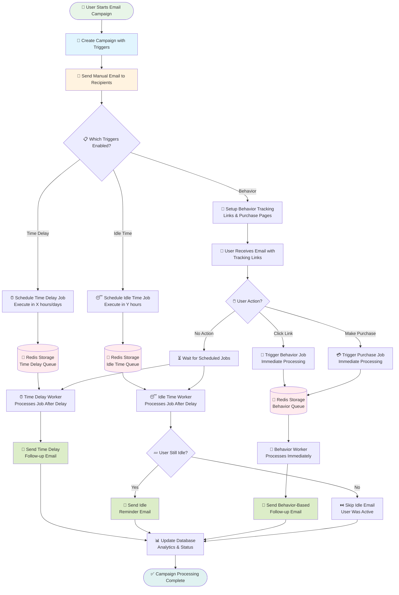
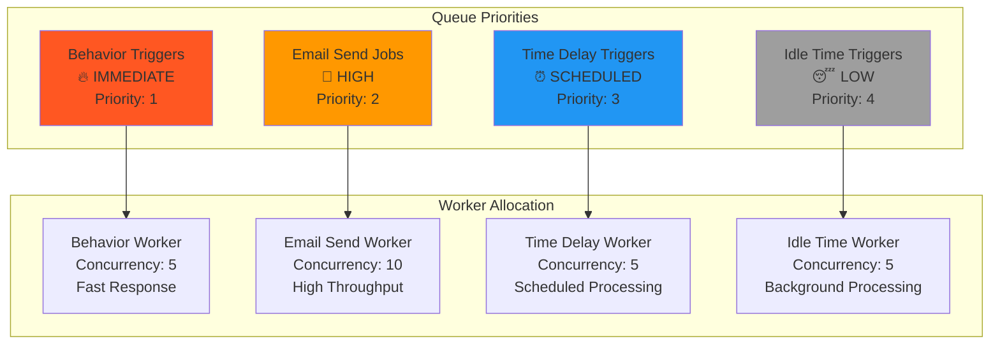
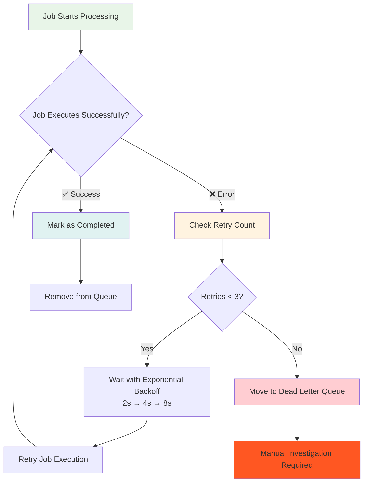

# 📈 **Simple Step-by-Step BullMQ Process Flow**

## **🚀 Complete Email Campaign Process (Linear Flow)**



## **⚡ Real-Time Example: Welcome Email Campaign**



```mermaid
gantt
    title Email Campaign Timeline Example
    dateFormat X
    axisFormat %H:%M
    
    section Email Sending
    Send Welcome Email                    :milestone, m1, 0, 0m
    
    section Time Delay Trigger
    Schedule 2-Hour Follow-up             :active, td1, 0, 1m
    Execute Time Delay Job                :milestone, m2, 120, 0m
    Send Follow-up Email                  :active, td2, 120, 5m
    
    section Idle Time Trigger
    Schedule 24-Hour Idle Check           :active, it1, 0, 1m
    Execute Idle Check Job                :milestone, m3, 1440, 0m
    Send Idle Email (if needed)           :active, it2, 1440, 5m
    
    section User Behavior
    User Clicks Link (anytime)            :crit, ub1, 30, 1m
    Process Click Behavior Job            :active, ub2, 31, 2m
    Send Click Follow-up                  :active, ub3, 33, 5m
```

## **🔧 Technical Implementation Flow**

```mermaid
flowchart LR
    subgraph "1️⃣ Job Creation"
        A[Queue Manager] --> B[Create Job with Data]
        B --> C[Set Delay/Priority]
        C --> D[Store in Redis]
    end
    
    subgraph "2️⃣ Redis Storage"
        D --> E[bull:queue:delayed<br/>Sorted by execution time]
        E --> F[bull:queue:waiting<br/>Ready for processing]
        F --> G[bull:queue:active<br/>Being processed]
    end
    
    subgraph "3️⃣ Worker Processing"
        G --> H[Worker Picks Up Job]
        H --> I[Execute Job Function]
        I --> J{Success?}
        J -->|Yes| K[Mark as Completed]
        J -->|No| L[Retry with Backoff]
        L --> F
    end
    
    subgraph "4️⃣ Job Completion"
        K --> M[Update Database]
        M --> N[Send Email]
        N --> O[Update Analytics]
        O --> P[Schedule Next Trigger]
    end
    
    style A fill:#e8f5e8
    style E fill:#ffebee
    style F fill:#fff3e0
    style G fill:#e1f5fe
    style K fill:#e0f2f1
    style L fill:#ffcdd2
```



## **📊 Queue Priority & Processing Order**



## **🔄 Error Handling & Retry Logic**



## **💾 Redis Data Structure Example**

```
📁 Redis Keys for BullMQ:

🔑 bull:time-delay-trigger:id          → "1001" (next job ID)
🔑 bull:time-delay-trigger:waiting     → [] (list of waiting job IDs)
🔑 bull:time-delay-trigger:delayed     → {score: timestamp, value: jobId}
🔑 bull:time-delay-trigger:active      → [] (currently processing jobs)
🔑 bull:time-delay-trigger:completed   → [] (finished jobs)
🔑 bull:time-delay-trigger:failed      → [] (failed jobs)

📋 Individual Job Data:
🔑 bull:time-delay-trigger:jobs:1001   → {
    "id": "1001",
    "data": {
        "campaignId": "60f7b3b3b3b3b3b3b3b3b3b3",
        "recipientEmail": "user@example.com",
        "manualEmailIndex": 0
    },
    "delay": 7200000,
    "timestamp": 1640995200000,
    "attempts": 0
}
```